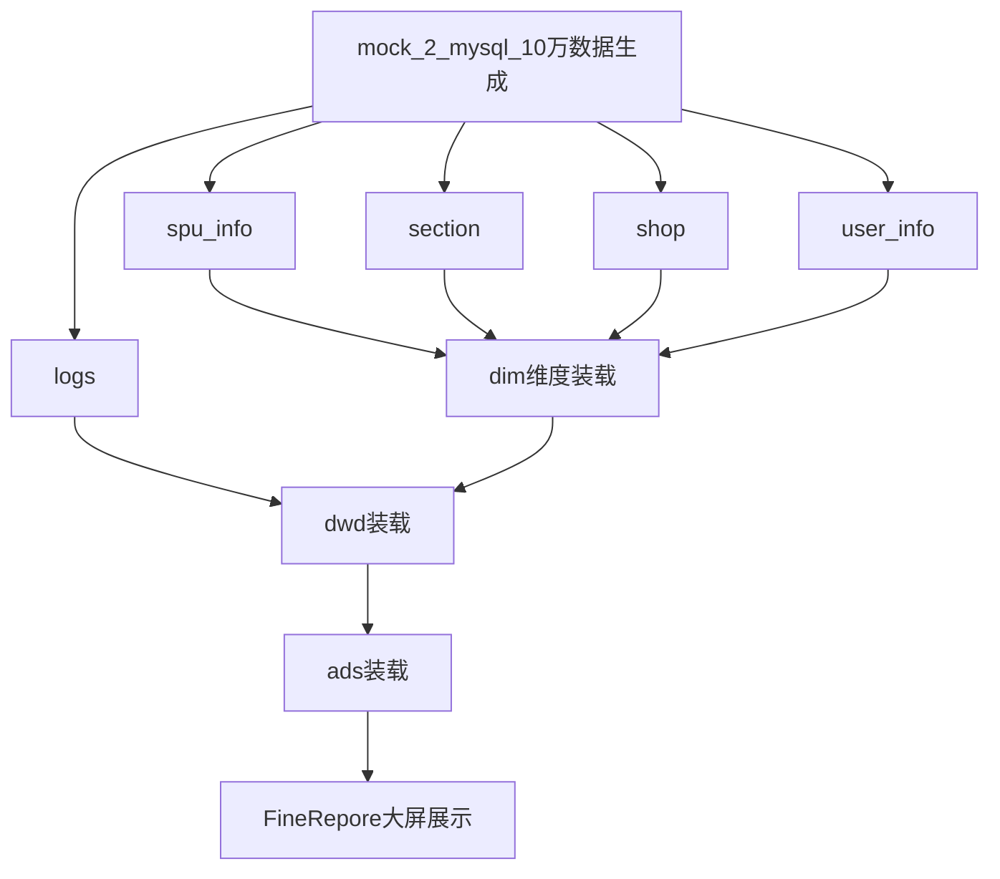

<br>

## 指标分析  

1. 每个商品的访问次数  
2. 每个板块的总访问次数
3. 每个店铺的总访问次数
4. 每个板块下的商品访问次数占板块次数的百分比
5. 每个商店下的板块访问次数占商店次数的百分比
6. 店铺访问平均停留时长
----
## 分析维度
	用户维度:一个用户可以访问多个店铺
	店铺维度:会有多个店铺
	板块维度:一个店铺会有多个板块
	商品维度:一个板块会有多个商品
----
## 维度表构建

1. 用户维度
	- 用户id
	- 用户名字
	- 用户电话
	- 生日
	- 性别
	- 地区
	- 创建日期
	
```sql
--用户维度表
create external table if not exists ods_user_info_inc  
(  
    user_id string comment "用户id",  
    user_name string comment "用户名字",  
    user_num string comment "用户电话",  
    user_birthday string comment "生日",  
    user_gender string comment "性别",  
    region string comment "地区",  
    create_time string comment "创建日期",  
    ds string  
)comment '用户表'  
partitioned by (`ds` string comment '统计日期')  
stored as orc  
location '/warehouse/page/ods/dim_complex_full'  
tblproperties('orc.compress'='snappy');
```

2. 店铺维度
	- 店铺id
	 - 店铺名字
	 - 创建日期
	
```sql
--店铺维度表
create table if not exists ods_shop_full  
(  
    shop_id string comment "店铺id",  
    shop_name string comment "店铺名字",  
    create_time string comment "创建时间"  
)comment '店铺表'  
partitioned by (`ds` string comment '统计日期')  
stored as orc  
location '/warehouse/page/ods/ods_shop_full'  
tblproperties('orc.compress'='snappy');
```

3. 板块维度
	-  板块id
	 - 板块名字
	 - 所属店铺id
	 - 创建日期
	
```sql
--板块维度表
create table if not exists ods_section_full  
(  
    section_id string comment "板块id",  
    section_name string comment "板块名字",  
    shop_id string comment "所属商店id",  
    create_time string comment "创建时间"  
)comment '板块表'  
partitioned by (`ds` string comment '统计日期')  
stored as orc  
location '/warehouse/page/ods/ods_section_full'  
tblproperties('orc.compress'='snappy');
```

 4.  商品维度
	- 商品id
	- 商品名字
	- 商品价格
	- 所属板块id
	- 创建日期
	
```sql
--商品维度表
create table if not exists ods_spu_info_full  
(  
    spu_id string comment "商品id",  
    spu_name string comment "商品名字",  
    amount double comment "商品价格",  
    section_id string comment "所属板块id",  
    create_time string comment "创建时间"  
)comment '商品表'  
partitioned by (`ds` string comment '统计日期')  
stored as orc  
location '/warehouse/page/ods/ods_spu_info_full'  
tblproperties('orc.compress'='snappy');
```


----
## 事实表分析

1. 维度宽表

| 商品id | 板块id | 店铺id |
| ---- | ---- | ---- |
| 1 | 1 | 1 |
| 2 | 1 | 1 |
| 3 | 1 | 1 |
| 4 | 2 | 1 |
| 5 | 2 | 1 |
| 6 | 2 | 1 |
| 7 | 2 | 1 |
| 8 | 3 | 2 |
| 9 | 3 | 2 |
| 10 | 3 | 2 |


2. 日志数据

| 页面类型 | 店铺id | 板块id | 商品id |
| ---- | ---- | ---- | ---- |
| 商店 | 1 | null | null |
| 商店 | 1 | null | null |
| 板块 | null | 1 | null |
| 板块 | null | 2 | null |
| 商品 | null | null | 1 |
| 商品 | null | null | 2 |


* 通过下面逻辑来实现自动的关联

|页面类型|维度关联规则|示例数据转换|
| ---- | ---- | ---- |
|商店页|shop_id有效，其他维度置空|(shop_id=1, section_id=NULL, item_id=NULL)|
|板块页|section_id有效，自动关联所属店铺|(shop_id=1, section_id=1, item_id=NULL)|
|商品页|item_id有效，自动关联板块和店铺|(shop_id=1, section_id=1, item_id=1)|

- 处理过后的字段

|page_type| shop_id | section_id | item_id |
|---------|---------|------------|---------|
|shop     | 1       | NULL       | NULL    |
|section  | 1       | 1          | NULL    |
|item     | 1       | 1          | 1       |

----
## 事实表构建

1. 事实表字段
	- 日志id
	- 用户id
	- 店铺id
	- 板块id
	- 商品id
	- 页面类型
	- 停留时长
	- 访问时间
```sql
create table if not exists ods_logs_inc  
(  
    log_id     string comment "日志id",  
    user_id    string comment "用户id",  
    shop_id    string comment "店铺id",  
    section_id string comment "板块id",  
    spu_id string comment "商品id",  
    page_type string comment "页面类型",  
    during_time int comment "停留时长(秒)",  
    request_time string comment "访问时间"  
)comment '用户行为日志事实表'  
partitioned by (`ds` string comment '统计日期')  
stored as orc  
location '/warehouse/page/ods/ods_logs_inc'  
tblproperties('orc.compress'='snappy');
```

---
## 数据模拟

1. 编写python脚本模拟维度数据
2. 查询维度数据获取维度数据的id
3. 模拟日志数据
----
## 数据同步

1. 使用seatunnel批同步数据
----
## dim层构建

1. 由于用户表属于缓慢增长维,使用全量同步对于资源消耗很大,使用拉链表可以有效的提高效率
----
## dwd层构建

1. 制作日志表和维度表关联的宽表,为后续数据提供支撑
----
## ads层构建

1. 商品访问次数1天7天30天统计表
```sql
create table if not exists ads_spu_visit  
(  
    spu_id string comment '商品id',  
    spu_name string comment '商品名字',  
    visit_count_1d bigint comment '1天访问次数',  
    visit_count_7d bigint comment '7天访问次数',  
    visit_count_30d bigint comment '30天访问次数'  
) comment '商品访问次数1天7天30天统计表'  
partitioned by (ds string comment '统计日期（指标计算基准日期）')  
stored as orc  
location '/warehouse/page/ads/ads_spu_visit'  
tblproperties ('orc.compress'='snappy');
```
2. 板块访问次数1天7天30天统计表
```sql
 create table if not exists ads_section_visit  
(  
    section_id string comment '板块id',  
    section_name string comment '板块名字',  
    visit_count_1d bigint comment '1天访问次数',  
    visit_count_7d bigint comment '7天访问次数',  
    visit_count_30d bigint comment '30天访问次数'  
) comment '板块访问次数1天7天30天统计表'  
partitioned by (ds string comment '统计日期')  
stored as orc  
location '/warehouse/page/ads/ads_section_visit'  
tblproperties ('orc.compress'='snappy');
```
3. 店铺访问次数1天7天30天统计表
```sql
create table if not exists ads_shop_visit  
(  
    shop_id string comment '店铺id',  
    shop_name string comment '店铺名字',  
    visit_count_1d bigint comment '1天访问次数',  
    visit_count_7d bigint comment '7天访问次数',  
    visit_count_30d bigint comment '30天访问次数'  
) comment '店铺访问次数1天7天30天统计表'  
partitioned by (ds string comment '统计日期')  
stored as orc  
location '/warehouse/page/ads/ads_shop_visit'  
tblproperties ('orc.compress'='snappy');
```
4. 商品访问占板块访问比例1天7天30天统计表
```sql
create table if not exists ads_section_spu_ratio  
(  
    section_id string comment '板块id',  
    section_name string comment '板块名字',  
    spu_id string comment '商品id',  
    spu_name string comment '商品名字',  
    ratio_1d double comment '1天占比',  
    ratio_7d double comment '7天占比',  
    ratio_30d double comment '30天占比'  
) comment '商品访问占板块访问比例1天7天30天统计表'  
partitioned by (ds string comment '统计日期')  
stored as orc  
location '/warehouse/page/ads/ads_section_spu_ratio'  
tblproperties ('orc.compress'='snappy');
```
5. 板块访问占店铺访问比例1天7天30天统计表
```sql
create table if not exists ads_shop_section_ratio  
(  
    shop_id string comment '店铺id',  
    shop_name string comment '店铺名字',  
    section_id string comment '板块id',  
    section_name string comment '板块名字',  
    ratio_1d double comment '1天占比',  
    ratio_7d double comment '7天占比',  
    ratio_30d double comment '30天占比'  
) comment '板块访问占店铺访问比例1天7天30天统计表'  
partitioned by (ds string comment '统计日期')  
stored as orc  
location '/warehouse/page/ads/ads_shop_section_ratio'  
tblproperties ('orc.compress'='snappy');
```
6. 店铺访问平均停留时长1天7天30天统计表
```sql
create table if not exists ads_shop_avg_stay  
(  
    shop_id string comment '店铺id',  
    shop_name string comment '店铺名字',  
    avg_stay_time_1d double comment '1天平均停留时长(秒)',  
    avg_stay_time_7d double comment '7天平均停留时长(秒)',  
    avg_stay_time_30d double comment '30天平均停留时长(秒)'  
) comment '店铺访问平均停留时长1天7天30天统计表'  
partitioned by (ds string comment '统计日期')  
stored as orc  
location '/warehouse/page/ads/ads_shop_avg_stay'  
tblproperties ('orc.compress'='snappy');
```

---
## FineReport大屏展示


|大屏模块/主题|推荐数据表|推荐图表类型|关键字段（维度&指标）|设计说明|
|---|---|---|---|---|
|1. 商品访问趋势|ads_spu_visit|折线图/面积图|维度：spu_name，时间维度用分区字段dS 指标：visit_count_1d`, `visit_count_7d`, `visit_count_30d`|展示重点商品在不同时间维度的访问趋势，支持筛选商品和日期范围。|
|2. 板块访问分布|ads_section_visit|环形图/饼图|维度：section_name 指标：visit_count_1d（默认当天）|展示当天各板块访问量占比，突出热门板块。|
|3. 店铺访问排名|ads_shop_visit|柱状图/条形图|维度：shop_name 指标：visit_count_1d`、`visit_count_7d`、`visit_count_30d`|按访问量排名店铺，支持切换时间维度查看趋势。|
|4. 商品在板块访问占比|ads_section_spu_ratio|堆积条形图/百分比堆积图|维度：`section_name`, `spu_name`  <br>指标：`ratio_1d`, `ratio_7d`, `ratio_30d`|显示某板块内各商品访问占比，便于了解重点商品贡献度。|
|5. 板块在店铺访问占比|ads_shop_section_ratio|堆积柱状图/百分比堆积图|维度：`shop_name`, `section_name`  <br>指标：`ratio_1d`, `ratio_7d`, `ratio_30d`|展示店铺下各板块访问占比，洞察店铺流量来源。|
|6. 店铺平均停留时长|ads_shop_avg_stay|折线图/雷达图|维度：`shop_name`  指标：`avg_stay_time_1d`, `avg_stay_time_7d`, `avg_stay_time_30d`|对比店铺访问的用户停留时长，发现用户粘性较高的店铺。|


----
## DolphinScheduler调度流程





